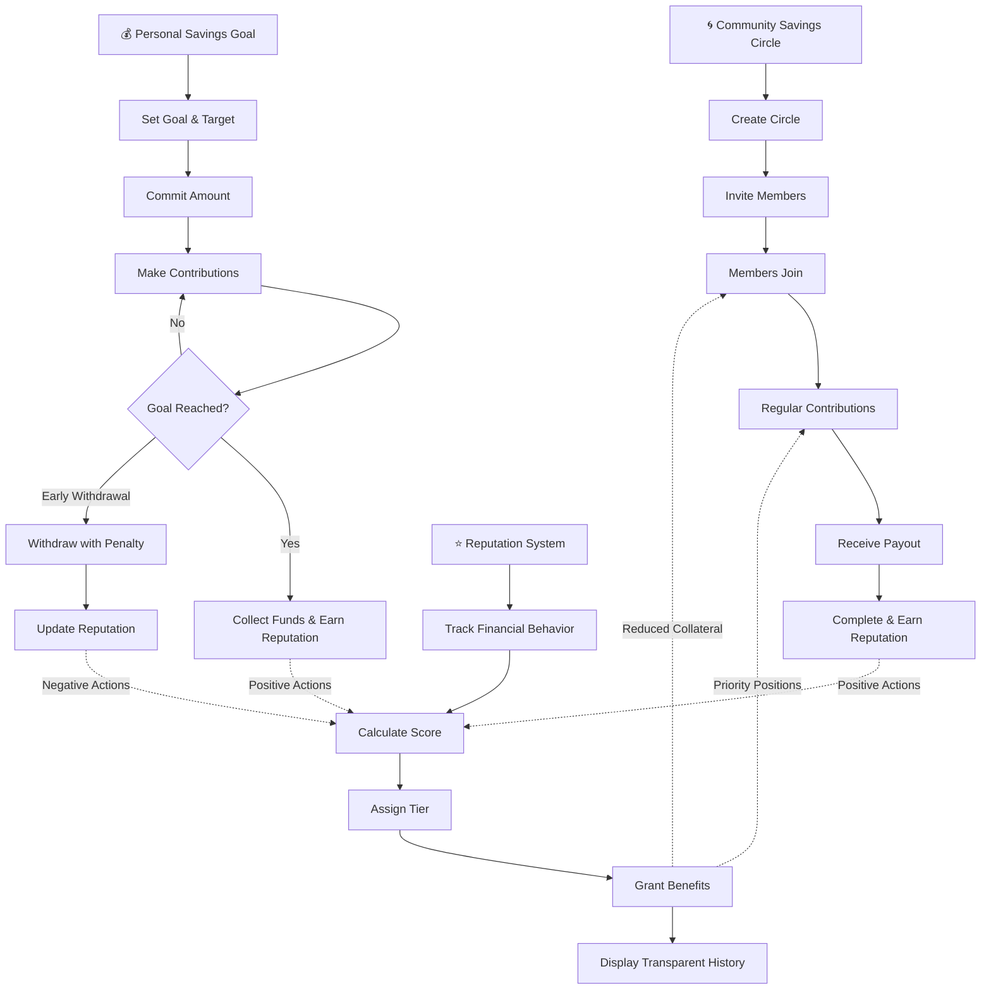

```mermaid
graph TD
    A["🌀 Community Savings Circle"] --> B["Create Circle"]
    B --> C["Invite Members"]
    C --> D["Members Join"]
    D --> E["Regular Contributions"]
    E --> F["Receive Payout"]
    F --> G["Complete & Earn Reputation"]
    
    H["💰 Personal Savings Goal"] --> I["Set Goal & Target"]
    I --> J["Commit Amount"]
    J --> K["Make Contributions"]
    K --> L{Goal Reached?}
    L -->|Yes| M["Collect Funds & Earn Reputation"]
    L -->|No| K
    L -->|Early Withdrawal| N["Withdraw with Penalty"]
    N --> O["Update Reputation"]
    
    P["⭐ Reputation System"] --> Q["Track Financial Behavior"]
    Q --> R["Calculate Score"]
    R --> S["Assign Tier"]
    S --> T["Grant Benefits"]
    T --> U["Display Transparent History"]
    
    G -.->|Positive Actions| R
    M -.->|Positive Actions| R
    O -.->|Negative Actions| R
    
    T -.->|Priority Positions| E
    T -.->|Reduced Collateral| D
```
